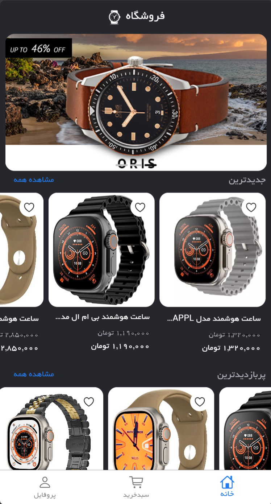
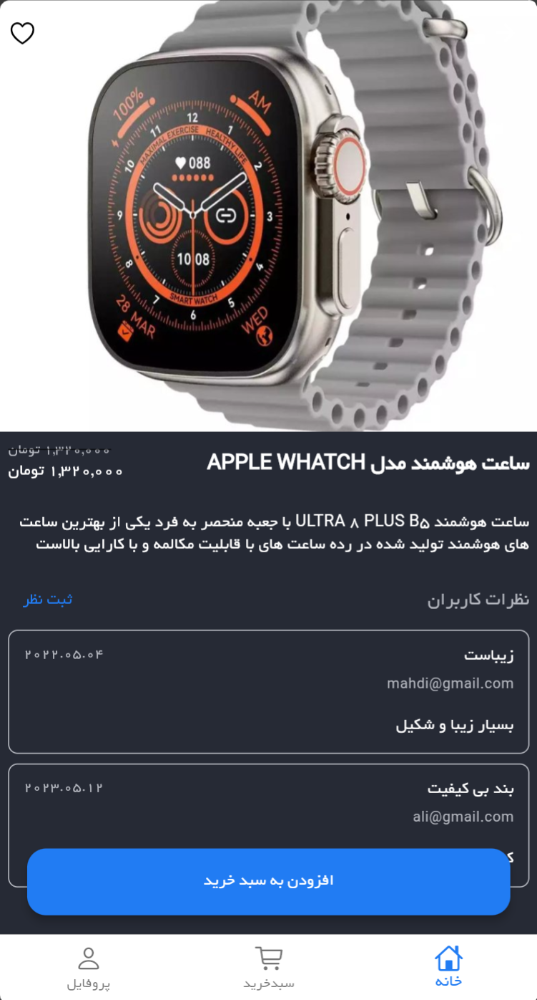
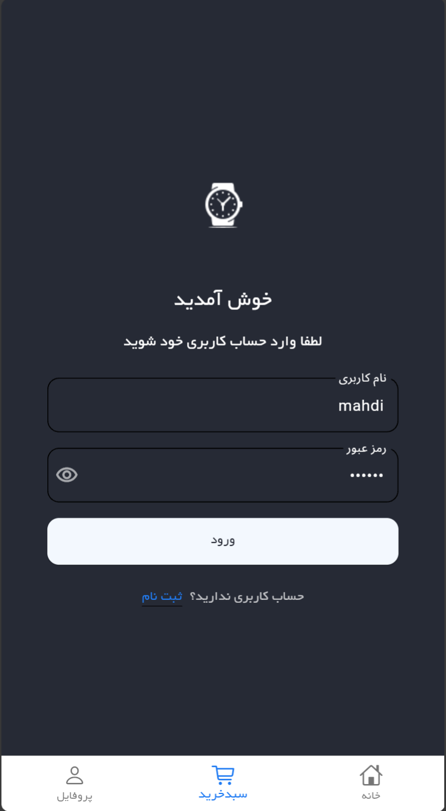
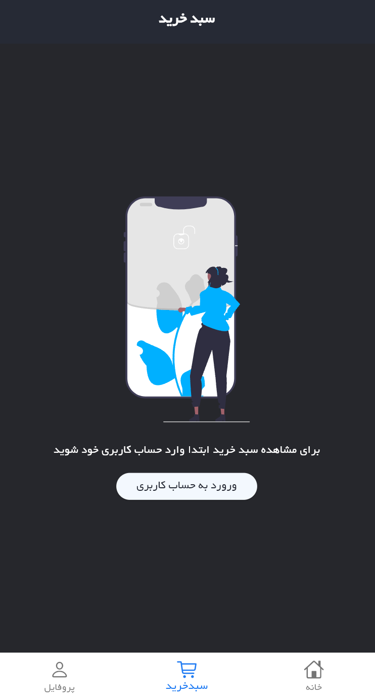
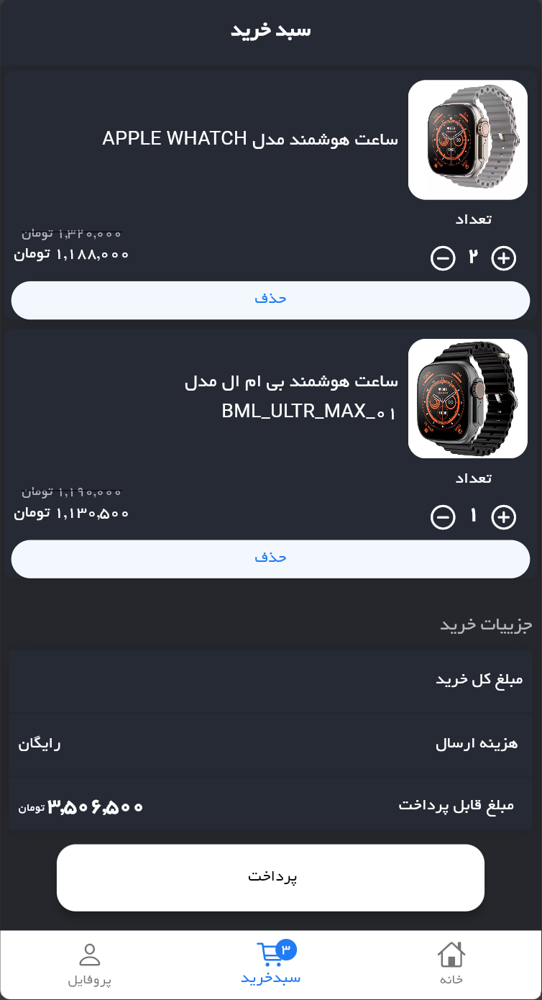
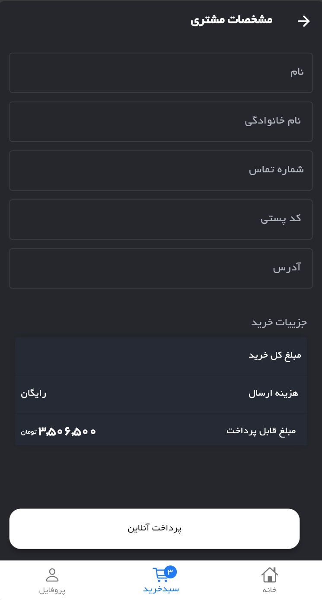

# ShopApp
A watch shop application with Flutter, using Bloc as state management and parse server back4app as backend.

  

&nbsp;

## Home screen
You can explore and like products on home screen

&nbsp;

## Details screen
By clicking on each product, you are able to see its details

&nbsp;

## Login screen
When restarting app, you will automatically loged in by access token saved on your device

&nbsp;

## Cart screen
You can add products to cart

&nbsp;

&nbsp;

## Order screen
After you added products to your cart, then you can see, edit and purchase them here

&nbsp;

